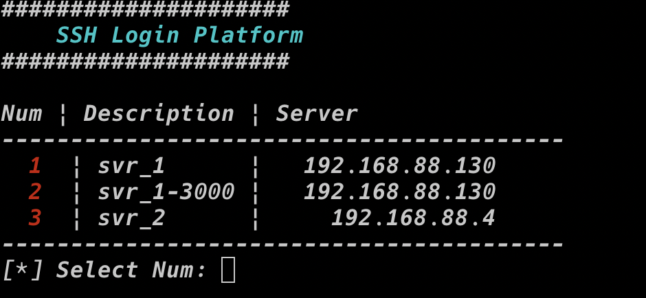

# ssh login tool


## Run

1. git clone 
```
git clone https://github.com/duyuanchao/ssh-login-tool.git
```

2. modified login info in `password.lst`, all the username and password is saved in plaintext. The format is:
```
index:IP:port:user:password:description
1:192.168.88.130:22:root:passwd:svr_1
2:192.168.88.130:3000:user:passwd:svr_1-3000
3:192.168.88.4:22:root:passwd:svr_2
```  
3. add alias to your bashrc(`~/.bashrc`) or zshrc(`~/.zshrc`)
```
alias s='bash /path/to/folder/ssh-login-tool/server_login.sh'
```
4. type s in your terminal and login to your server




## Note
This repo is modified from https://github.com/ca0gu0/so